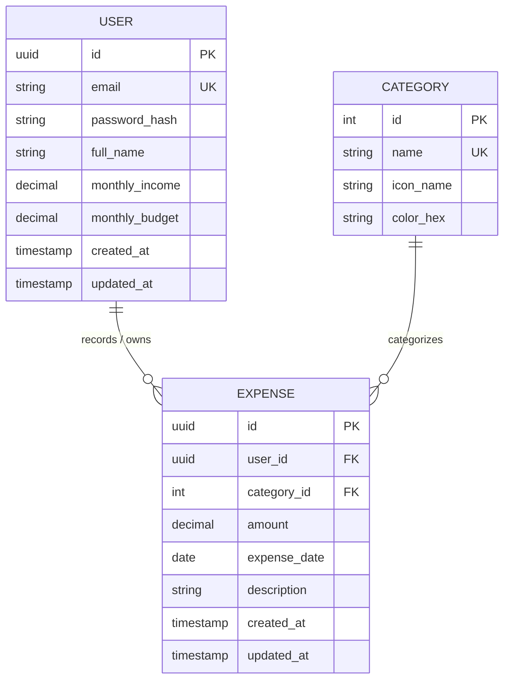

# Database Design Document
## Finance Expense Tracking App

**Course:** Agile Software Development  
**Document Version:** 1.0  
**Date:** September 12, 2026  
**Status:** Approved Baseline  

---

## 1. Introduction

### 1.1 Purpose
This document provides a comprehensive database design specification for the **Finance Expense Tracking App** Minimum Viable Product (MVP). It covers the conceptual, logical, and physical data models, detailed data dictionaries, indexing strategies, data integrity rules, and database migration scripts.

### 1.2 System Scope
The database supports two core application modules:
1. **User Registration & Profile:** Secure authentication data, personal profile credentials, and baseline financial settings (`monthly_income`, `monthly_budget`).
2. **Expense Tracking Engine:** Categorized expense transaction logs (`amount`, `expense_date`, `description`, `category_id`) associated with authenticated users.

### 1.3 Database Technology Selection
- **Database Engine:** Relational Database (PostgreSQL 15+ / SQLite 3 for local development).
- **Rationale:** Relational integrity (ACID compliance) is critical for financial transactions. Foreign key enforcement, strict decimal precision, and composite indexing ensure reliable calculation of balances and secure data isolation.
- **ORM / Query Layer:** Compatible with Prisma, TypeORM, SQLAlchemy, or raw SQL migrations.

---

## 2. Conceptual Data Model

### 2.1 Entities & Relationships
- **User:** Represents an individual using the application. A user owns zero, one, or many expenses (`1:N`).
- **Category:** Represents classification labels for expenditures. A category classifies zero, one, or many expenses (`1:N`).
- **Expense:** Represents an individual monetary expenditure incurred by a specific user on a given date, assigned to one category.

### 2.2 Conceptual Entity Relationship Diagram (ERD)



---

## 3. Logical Data Model & Normalization

### 3.1 Normalization Analysis
- **First Normal Form (1NF):**
  - All attributes contain atomic values (e.g., `amount` is a scalar numeric, `full_name` is an atomic string).
  - Every table has a distinct primary key (`id`).
  - No repeating groups or arrays exist within column definitions.
- **Second Normal Form (2NF):**
  - All tables are in 1NF.
  - All non-key attributes are fully functionally dependent on the entire primary key (single-column primary keys are utilized throughout).
- **Third Normal Form (3NF):**
  - All tables are in 2NF.
  - No transitive dependencies exist. For example, category names and icons reside in the `categories` table rather than duplicating text labels inside `expenses`.

---

## 4. Physical Database Schema & Data Dictionary

### 4.1 Table: `users`
Stores user profile information, authentication credentials, and baseline financial settings.

| Column | Data Type | Nullable | Default | Constraints | Description |
| :--- | :--- | :--- | :--- | :--- | :--- |
| `id` | `UUID` | No | `gen_random_uuid()` | `PRIMARY KEY` | Unique identifier for the user |
| `email` | `VARCHAR(255)` | No | None | `UNIQUE`, `NOT NULL` | User email address (login credential) |
| `password_hash` | `VARCHAR(255)` | No | None | `NOT NULL` | Salted bcrypt/Argon2 password hash |
| `full_name` | `VARCHAR(100)` | No | None | `NOT NULL` | User's full display name |
| `monthly_income` | `DECIMAL(12, 2)` | No | `0.00` | `CHECK (monthly_income >= 0)` | Expected monthly income |
| `monthly_budget` | `DECIMAL(12, 2)` | No | `0.00` | `CHECK (monthly_budget >= 0)` | Target monthly spending allowance |
| `created_at` | `TIMESTAMPTZ` | No | `CURRENT_TIMESTAMP`| `NOT NULL` | Timestamp when user registered |
| `updated_at` | `TIMESTAMPTZ` | No | `CURRENT_TIMESTAMP`| `NOT NULL` | Timestamp when profile was last updated |

---

### 4.2 Table: `categories`
Defines standardized expenditure classification categories.

| Column | Data Type | Nullable | Default | Constraints | Description |
| :--- | :--- | :--- | :--- | :--- | :--- |
| `id` | `SERIAL` / `INT` | No | Auto-increment | `PRIMARY KEY` | Unique category ID |
| `name` | `VARCHAR(50)` | No | None | `UNIQUE`, `NOT NULL` | Category name (e.g., Food & Dining) |
| `icon_name` | `VARCHAR(50)` | Yes | `'tag'` | Nullable | Frontend icon identifier (e.g., Lucide icon) |
| `color_hex` | `VARCHAR(7)` | Yes | `'#64748B'` | Nullable | Color accent code for UI badges |

---

### 4.3 Table: `expenses`
Stores individual expenditure transactions recorded by users.

| Column | Data Type | Nullable | Default | Constraints | Description |
| :--- | :--- | :--- | :--- | :--- | :--- |
| `id` | `UUID` | No | `gen_random_uuid()` | `PRIMARY KEY` | Unique expense transaction ID |
| `user_id` | `UUID` | No | None | `FOREIGN KEY`, `NOT NULL` | References `users(id)` `ON DELETE CASCADE` |
| `category_id` | `INT` | No | None | `FOREIGN KEY`, `NOT NULL` | References `categories(id)` `ON DELETE RESTRICT` |
| `amount` | `DECIMAL(12, 2)` | No | None | `CHECK (amount > 0)`, `NOT NULL`| Transaction value (> 0.00) |
| `expense_date` | `DATE` | No | `CURRENT_DATE` | `NOT NULL` | Date when expense occurred |
| `description` | `VARCHAR(255)` | No | None | `NOT NULL` | Brief memo or explanation |
| `created_at` | `TIMESTAMPTZ` | No | `CURRENT_TIMESTAMP`| `NOT NULL` | System record creation timestamp |
| `updated_at` | `TIMESTAMPTZ` | No | `CURRENT_TIMESTAMP`| `NOT NULL` | System record modification timestamp |

---

## 5. Physical DDL (Data Definition Language) Script

```sql
-- ============================================================================
-- Finance Expense Tracking App - Database Schema DDL
-- Compatible with PostgreSQL 14+
-- ============================================================================

-- Enable UUID generation extension if not present
CREATE EXTENSION IF NOT EXISTS "pgcrypto";

-- 1. Create Users Table
CREATE TABLE users (
    id UUID PRIMARY KEY DEFAULT gen_random_uuid(),
    email VARCHAR(255) NOT NULL,
    password_hash VARCHAR(255) NOT NULL,
    full_name VARCHAR(100) NOT NULL,
    monthly_income DECIMAL(12, 2) NOT NULL DEFAULT 0.00,
    monthly_budget DECIMAL(12, 2) NOT NULL DEFAULT 0.00,
    created_at TIMESTAMPTZ NOT NULL DEFAULT CURRENT_TIMESTAMP,
    updated_at TIMESTAMPTZ NOT NULL DEFAULT CURRENT_TIMESTAMP,
    CONSTRAINT uq_users_email UNIQUE (email),
    CONSTRAINT chk_positive_income CHECK (monthly_income >= 0.00),
    CONSTRAINT chk_positive_budget CHECK (monthly_budget >= 0.00)
);

-- 2. Create Categories Table
CREATE TABLE categories (
    id SERIAL PRIMARY KEY,
    name VARCHAR(50) NOT NULL,
    icon_name VARCHAR(50) DEFAULT 'tag',
    color_hex VARCHAR(7) DEFAULT '#64748B',
    CONSTRAINT uq_category_name UNIQUE (name)
);

-- 3. Create Expenses Table
CREATE TABLE expenses (
    id UUID PRIMARY KEY DEFAULT gen_random_uuid(),
    user_id UUID NOT NULL,
    category_id INT NOT NULL,
    amount DECIMAL(12, 2) NOT NULL,
    expense_date DATE NOT NULL DEFAULT CURRENT_DATE,
    description VARCHAR(255) NOT NULL,
    created_at TIMESTAMPTZ NOT NULL DEFAULT CURRENT_TIMESTAMP,
    updated_at TIMESTAMPTZ NOT NULL DEFAULT CURRENT_TIMESTAMP,
    CONSTRAINT fk_expenses_user FOREIGN KEY (user_id) 
        REFERENCES users(id) ON DELETE CASCADE,
    CONSTRAINT fk_expenses_category FOREIGN KEY (category_id) 
        REFERENCES categories(id) ON DELETE RESTRICT,
    CONSTRAINT chk_positive_amount CHECK (amount > 0.00)
);

-- ============================================================================
-- Indexes for Performance Optimization
-- ============================================================================

-- Index for User Login by Email
CREATE INDEX idx_users_email ON users(email);

-- Composite Index for Recent Transactions feed: ordered by date descending
CREATE INDEX idx_expenses_user_date ON expenses(user_id, expense_date DESC, created_at DESC);

-- Index for filtering expenses by category per user
CREATE INDEX idx_expenses_user_category ON expenses(user_id, category_id);

-- ============================================================================
-- Seed Data: Standard Expense Categories
-- ============================================================================

INSERT INTO categories (name, icon_name, color_hex) VALUES
('Food & Dining', 'utensils', '#EF4444'),
('Groceries', 'shopping-cart', '#F59E0B'),
('Transportation', 'car', '#3B82F6'),
('Housing & Utilities', 'home', '#10B981'),
('Entertainment', 'film', '#8B5CF6'),
('Healthcare', 'heart-pulse', '#EC4899'),
('Personal Care', 'smile', '#06B6D4'),
('Miscellaneous', 'more-horizontal', '#6B7280')
ON CONFLICT (name) DO NOTHING;
```

---

## 6. Query Optimization & Access Patterns

### 6.1 Frequent Query 1: Fetch Recent Transactions Feed
- **Objective:** Render the user's latest 10 transactions with category metadata.
- **Access Pattern:**
```sql
SELECT 
    e.id,
    e.amount,
    e.expense_date,
    e.description,
    c.name AS category_name,
    c.icon_name AS category_icon,
    c.color_hex AS category_color,
    e.created_at
FROM expenses e
JOIN categories c ON e.category_id = c.id
WHERE e.user_id = $1
ORDER BY e.expense_date DESC, e.created_at DESC
LIMIT 10;
```
- **Optimization:** Served directly by the composite B-Tree index `idx_expenses_user_date(user_id, expense_date DESC, created_at DESC)`, avoiding full-table scans.

### 6.2 Frequent Query 2: Monthly Spending Summary
- **Objective:** Compute total expenditures for the current calendar month to display progress against `monthly_budget`.
- **Access Pattern:**
```sql
SELECT 
    COALESCE(SUM(amount), 0.00) AS total_spent
FROM expenses
WHERE user_id = $1
  AND expense_date >= DATE_TRUNC('month', CURRENT_DATE)
  AND expense_date < DATE_TRUNC('month', CURRENT_DATE) + INTERVAL '1 month';
```
- **Optimization:** Range scan over index `idx_expenses_user_date` filtered by `user_id` and bounded `expense_date`.

---

## 7. Data Integrity, Security & Business Rules

### 7.1 Entity & Referential Integrity
- **Primary Keys:** UUIDs are utilized for `users` and `expenses` to prevent enumeration attacks, ID guessing, and ID collisions across distributed nodes.
- **Cascade Behavior:** Deleting a user (`ON DELETE CASCADE`) automatically purges their associated expense records to maintain GDPR/data hygiene compliance. Deleting an active category is blocked (`ON DELETE RESTRICT`) to protect transaction data consistency.

### 7.2 Domain & Business Constraints
- **Amount Integrity:** `CHECK (amount > 0.00)` ensures negative or zero-value transactions cannot be stored in the database.
- **Currency Format:** Uses fixed-point `DECIMAL(12, 2)` rather than `FLOAT`/`REAL` to eliminate floating-point arithmetic rounding errors.
- **Budget Non-Negativity:** `CHECK (monthly_budget >= 0.00)` and `CHECK (monthly_income >= 0.00)` prevent corrupt preferences.

### 7.3 Data Privacy & Multi-Tenant Isolation
- **Row-Level Tenant Isolation:** Every query on the `expenses` table MUST include the condition `WHERE user_id = :session_user_id` enforced in the application backend service or via Database Row-Level Security (RLS).
- **Password Security:** The database stores only one-way cryptographic hashes (`password_hash`), never plain text.

---

## 8. Migration & Maintenance Strategy

1. **Migration Tooling:** Managed through version-controlled database migrations (e.g., Prisma Migrate or Knex.js).
2. **Automated Timestamps:** Trigger functions or ORM hooks update `updated_at` whenever a user or expense record is updated:
```sql
CREATE OR REPLACE FUNCTION update_timestamp()
RETURNS TRIGGER AS $$
BEGIN
    NEW.updated_at = CURRENT_TIMESTAMP;
    RETURN NEW;
END;
$$ LANGUAGE plpgsql;

CREATE TRIGGER trg_update_users_timestamp
BEFORE UPDATE ON users
FOR EACH ROW EXECUTE FUNCTION update_timestamp();

CREATE TRIGGER trg_update_expenses_timestamp
BEFORE UPDATE ON expenses
FOR EACH ROW EXECUTE FUNCTION update_timestamp();
```
3. **Backup Cadence:** Daily snapshot backups with point-in-time recovery (PITR) enabled in staging and production environments.

---

## 9. Sign-off & Approval

| Stakeholder Role | Name | Status | Date |
| :--- | :--- | :--- | :--- |
| **Product Owner** | Project Stakeholder | Approved | September 12, 2026 |
| **Database Architect** | Lead Developer | Approved | September 12, 2026 |
| **Scrum Master** | Agile Facilitator | Approved | September 12, 2026 |
