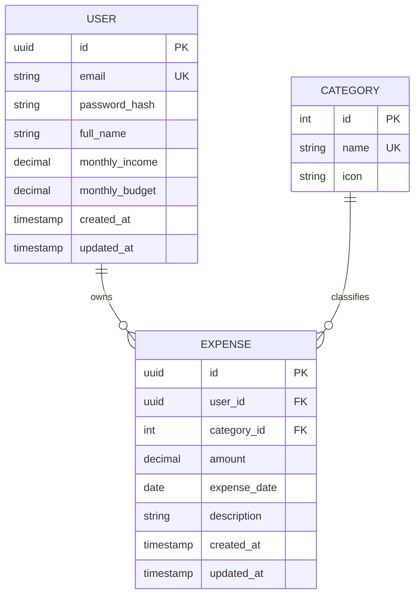

# Software Requirements Specification (SRS)
## Finance Expense Tracking App

**Course:** Agile Software Development  
**Document Version:** 1.0  
**Date:** September 12, 2026  
**Status:** Approved Baseline  

---

## 1. Introduction

### 1.1 Purpose
This document specifies the software requirements for the **Finance Expense Tracking App** Minimum Viable Product (MVP). It provides developers, testers, and academic stakeholders with a definitive description of the functional and non-functional requirements, data definitions, and acceptance criteria required for sprint planning and implementation.

### 1.2 Scope
The Finance Expense Tracking App is an accessible personal finance management tool. The MVP delivers two primary functional pillars:
1. **User Registration & Profile Management:** Secure account lifecycle, personal profile editing, and baseline income/budget configuration.
2. **Expense Tracking Engine:** Manual transaction creation (`Amount`, `Date`, `Description`, `Category`), record modification, deletion, and chronological transaction visualization.

Deferred future enhancements (e.g., bank sync, OCR receipt scanning, multi-currency support, collaborative budgeting) are outside the scope of this baseline.

### 1.3 Definitions, Acronyms, and Abbreviations
- **SRS:** Software Requirements Specification
- **MVP:** Minimum Viable Product
- **CRUD:** Create, Read, Update, Delete
- **JWT:** JSON Web Token
- **RBAC:** Role-Based Access Control
- **DoD:** Definition of Done
- **AC:** Acceptance Criteria

---

## 2. Overall System Description

### 2.1 Product Perspective
The system operates as an independent web application utilizing a client-server architecture:
- **Client (Frontend):** Responsive Single-Page Application (SPA) accessible via desktop and mobile web browsers.
- **Server (Backend):** RESTful API micro-service handling authentication, validation, and business logic.
- **Persistence Layer:** Relational or Document database storing encrypted user credentials, preferences, and transaction records.

```
+--------------------------------------------------+
|               User Web Browser / UI              |
+-------------------------+------------------------+
                          | HTTPS / JSON
                          v
+--------------------------------------------------+
|         Backend REST API (Auth & Logic)          |
+-------------------------+------------------------+
                          | SQL / ORM Queries
                          v
+--------------------------------------------------+
|           Database (Users & Expenses)            |
+--------------------------------------------------+
```

### 2.2 User Classes and Personas
- **Primary Persona – Budget-Conscious Individual (Student / Professional):** Needs a quick, friction-free way to log daily spending, monitor expenditures against their monthly allowance, and maintain financial awareness without steep learning curves.

### 2.3 Operating Environment
- **Client Side:** Modern browsers (Google Chrome 110+, Mozilla Firefox 110+, Safari 16+, Microsoft Edge 110+). Responsive on screen viewports >= 360px width.
- **Server Side:** Node.js (LTS) / Python 3.10+ runtime running on Linux/Windows.
- **Database:** PostgreSQL / SQLite / MongoDB.

---

## 3. Functional Requirements (MVP)

### 3.1 Module 1: User Registration & Profile

#### FR-1.1: Secure User Registration (Sign Up)
- **Description:** New users must be able to create a secure personal account.
- **User Story:** *As a new user, I want to sign up with my email and password so that I can have a private and secure account to track my finances.*
- **Detailed Specifications:**
  - System must capture `Email`, `Password`, and `Full Name`.
  - Email must conform to valid RFC 5322 format and be unique across the system.
  - Password must enforce a minimum length of 8 characters and contain at least one number or special symbol.
  - Passwords must be hashed using a secure cryptographic algorithm (e.g., bcrypt with minimum cost factor 10) before persistence.
- **Acceptance Criteria:**
  - **AC-1.1.1:** Submitting valid registration inputs generates a new user record and redirects the user to their dashboard or onboarding.
  - **AC-1.1.2:** Submitting an already registered email displays a clear error message: *"An account with this email already exists."*
  - **AC-1.1.3:** Submitting a password shorter than 8 characters shows a validation prompt: *"Password must be at least 8 characters long."*

#### FR-1.2: Secure User Authentication (Login / Logout)
- **Description:** Registered users must be able to log in securely and terminate their active sessions.
- **User Story:** *As a registered user, I want to securely log in with my credentials so that I can access my private financial records.*
- **Detailed Specifications:**
  - User submits `Email` and `Password`.
  - System verifies credentials against the stored hash.
  - Upon successful verification, an authenticated session token (e.g., JWT or secure HTTP-only cookie) is issued.
  - Users must be able to log out, which invalidates the current session token on the client/server.
- **Acceptance Criteria:**
  - **AC-1.2.1:** Valid credentials grant access and route the user to their personal dashboard.
  - **AC-1.2.2:** Invalid credentials display a generic error message: *"Invalid email or password."* (Preventing username enumeration).
  - **AC-1.2.3:** Logging out terminates the session and prevents back-navigation to authenticated views without re-authenticating.

#### FR-1.3: Set Basic Financial Preferences
- **Description:** Users can configure baseline financial parameters to anchor their budget tracking.
- **User Story:** *As a user, I want to set my monthly income and target budget so that I can monitor my spending limits effectively.*
- **Detailed Specifications:**
  - Fields supported:
    - `Monthly Income`: Decimal value (>= 0.00, precision 2 decimals).
    - `Monthly Budget`: Decimal value (>= 0.00, precision 2 decimals).
  - Can be configured during onboarding or modified at any point in the profile settings.
- **Acceptance Criteria:**
  - **AC-1.3.1:** Entering non-negative values updates the user's monthly income and budget preferences immediately.
  - **AC-1.3.2:** Submitting negative values or non-numerical characters triggers a validation error: *"Value must be a positive number."*

#### FR-1.4: View and Edit Personal Information
- **Description:** Users can inspect and modify their profile details and security settings.
- **User Story:** *As a user, I want to view and edit my personal details so that my account information remains accurate and up-to-date.*
- **Detailed Specifications:**
  - User can view their current registered `Full Name`, `Email`, `Monthly Income`, and `Monthly Budget`.
  - User can update `Full Name` and `Email` (subject to uniqueness validation).
  - User can change their password by supplying the current password followed by the new password and password confirmation.
- **Acceptance Criteria:**
  - **AC-1.4.1:** Profile screen displays current values correctly.
  - **AC-1.4.2:** Saving modifications updates the database and displays a success notification: *"Profile updated successfully."*
  - **AC-1.4.3:** Changing password fails if the current password does not match or if new passwords do not match.

---

### 3.2 Module 2: Expense Tracking

#### FR-2.1: Manual Expense Entry
- **Description:** Users can log individual expenditure transactions with required metadata.
- **User Story:** *As a user, I want to manually enter my expenses with amount, date, description, and category so that I have an organized record of my spending.*
- **Detailed Specifications:**
  - Required Fields:
    - `Amount`: Numerical value, strictly positive (> 0.00, max 2 decimal places).
    - `Date`: Date of expenditure in `YYYY-MM-DD` format (defaults to current date; allows past and present dates).
    - `Category`: Predefined standard categories (e.g., *Food & Dining*, *Transportation*, *Housing & Utilities*, *Entertainment*, *Healthcare*, *Groceries*, *Personal Care*, *Miscellaneous*).
    - `Description`: Text string (minimum 1 char, maximum 255 chars) describing the item or service.
- **Acceptance Criteria:**
  - **AC-2.1.1:** Submitting valid amount, date, description, and category creates the expense and reflects in the transaction feed immediately.
  - **AC-2.1.2:** Submitting an empty amount or an amount <= 0 triggers validation: *"Please enter an amount greater than 0."*
  - **AC-2.1.3:** Submitting without selecting a category or leaving description empty prevents submission and flags the missing field.

#### FR-2.2: Edit Existing Expense
- **Description:** Users can modify the details of previously recorded transactions.
- **User Story:** *As a user, I want to edit an existing expense so that I can correct typos or adjust values after making a mistake.*
- **Detailed Specifications:**
  - Clicking "Edit" on a transaction pre-populates an edit form/modal with existing `Amount`, `Date`, `Description`, and `Category`.
  - User can change any of the fields subject to standard input validations.
  - User must be authorized (only the owner of the expense record can edit it).
- **Acceptance Criteria:**
  - **AC-2.2.1:** Submitting updated values refreshes the record in the database and updates the transaction feed.
  - **AC-2.2.2:** Canceling the edit form leaves the original transaction unchanged.
  - **AC-2.2.3:** Editing an expense automatically recalculates total expenditures against the monthly budget.

#### FR-2.3: Delete Existing Expense
- **Description:** Users can permanently delete an erroneous or canceled expense record.
- **User Story:** *As a user, I want to delete an expense with confirmation so that I can remove unwanted records safely.*
- **Detailed Specifications:**
  - Clicking "Delete" presents a confirmation prompt: *"Are you sure you want to delete this expense? This action cannot be undone."*
  - User confirms or cancels.
  - Upon confirmation, record is deleted from database and removed from UI view.
- **Acceptance Criteria:**
  - **AC-2.3.1:** Confirming deletion removes the transaction from the UI and updates budget summaries immediately.
  - **AC-2.3.2:** Dismissing/canceling the prompt aborts deletion and keeps the record intact.

#### FR-2.4: Display List of Recent Transactions
- **Description:** Users can view a reverse-chronological list of recent expenditures.
- **User Story:** *As a user, I want to see a list of my recent transactions so that I can quickly review my recent spending behavior.*
- **Detailed Specifications:**
  - List displays transactions sorted by `Date` descending (most recent first).
  - Each list entry displays:
    - Category (with visual tag/badge or icon)
    - Description
    - Date formatted for readability (e.g., `Sep 12, 2026`)
    - Amount formatted with currency indicator (e.g., `$45.50`)
    - Action buttons: `Edit` and `Delete`
  - Empty state displays a friendly prompt: *"No expenses recorded yet. Click 'Add Expense' to get started."*
  - Top summary cards display:
    - Total Spent This Month
    - Remaining Monthly Budget (`Monthly Budget - Total Spent`)
- **Acceptance Criteria:**
  - **AC-2.4.1:** The list loads automatically upon opening the dashboard.
  - **AC-2.4.2:** Adding, editing, or deleting any transaction immediately updates the displayed list and total spend counters.

---

## 4. Data Models & Database Requirements

### 4.1 Entity Relationship Diagram (Conceptual)



### 4.2 Data Dictionary

#### 1. User Table (`users`)
| Column | Data Type | Nullable | Constraints / Description |
| :--- | :--- | :--- | :--- |
| `id` | UUID / INT | No | Primary Key |
| `email` | VARCHAR(255) | No | Unique, valid email index |
| `password_hash` | VARCHAR(255) | No | Salted bcrypt hash |
| `full_name` | VARCHAR(120) | No | User display name |
| `monthly_income` | DECIMAL(12,2)| Yes | Default `0.00`, value >= 0 |
| `monthly_budget` | DECIMAL(12,2)| Yes | Default `0.00`, value >= 0 |
| `created_at` | TIMESTAMP | No | Timestamp of creation |
| `updated_at` | TIMESTAMP | No | Timestamp of last update |

#### 2. Category Table (`categories`)
| Column | Data Type | Nullable | Constraints / Description |
| :--- | :--- | :--- | :--- |
| `id` | INT | No | Primary Key (auto-increment) |
| `name` | VARCHAR(64) | No | Unique category name |
| `icon` | VARCHAR(64) | Yes | Identifier for UI icon |

*Default Seed Data:* Food & Dining, Groceries, Transportation, Housing & Utilities, Entertainment, Healthcare, Miscellaneous.

#### 3. Expense Table (`expenses`)
| Column | Data Type | Nullable | Constraints / Description |
| :--- | :--- | :--- | :--- |
| `id` | UUID / INT | No | Primary Key |
| `user_id` | UUID / INT | No | Foreign Key -> `users(id)` ON DELETE CASCADE |
| `category_id` | INT | No | Foreign Key -> `categories(id)` |
| `amount` | DECIMAL(12,2)| No | Amount > 0.00 |
| `expense_date` | DATE | No | Transaction date |
| `description` | VARCHAR(255) | No | Memo / notes (1 - 255 chars) |
| `created_at` | TIMESTAMP | No | Auto timestamp |
| `updated_at` | TIMESTAMP | No | Auto timestamp |

---

## 5. Non-Functional Requirements (NFR)

### 5.1 Performance Requirements
- **NFR-PERF-01 (API Latency):** 95% of standard CRUD API requests must complete within 300ms under standard network conditions.
- **NFR-PERF-02 (Page Load):** Initial dashboard page load must render in under 1.5 seconds on desktop and 2.5 seconds on 4G mobile connections.

### 5.2 Security Requirements
- **NFR-SEC-01 (Password Encryption):** User passwords must never be stored in plain text; bcrypt or Argon2 hashing must be used.
- **NFR-SEC-02 (Data Isolation):** Users must only access, query, update, or delete transactions where `expense.user_id == current_user.id`.
- **NFR-SEC-03 (Input Sanitization):** All inputs must be sanitized on both client and server to prevent SQL Injection (SQLi) and Cross-Site Scripting (XSS).
- **NFR-SEC-04 (Transport Security):** All traffic between client and server must be encrypted over HTTPS/TLS 1.3 in staging and production.

### 5.3 Usability & Design Requirements
- **NFR-USE-01 (Responsiveness):** The interface must adapt seamlessly across desktop (1920x1080), tablet (768x1024), and mobile viewports (375x667).
- **NFR-USE-02 (Feedback & Validation):** Real-time client-side feedback must be displayed immediately upon submitting invalid forms.
- **NFR-USE-03 (Simplicity):** Entering an expense must require no more than 4 form fields and a single click to submit.

### 5.4 Reliability & Maintainability
- **NFR-REL-01 (Graceful Errors):** The system must handle unexpected server errors with friendly fallback UI states without application crashes.
- **NFR-MAINT-01 (Code Architecture):** Codebase must separate concerns clearly (Presentation, Business Logic, Persistence/Data Access Layer) to support agile sprint increments and automated testing.

---

## 6. External Interface Requirements

### 6.1 User Interface (UI) Requirements
- **Auth Screens:** Clean, focused Sign-in and Sign-up card forms.
- **Dashboard Screen:**
  - Header: App Title, User Profile Avatar/Name, Logout button.
  - Metrics Bar: Monthly Income, Monthly Budget, Total Spent, Remaining Budget.
  - Main Actions: Prominent "+ Add Expense" trigger button.
  - Content Area: Scrollable table or card list showing Recent Transactions with Edit and Delete icons.
- **Expense Modal / Drawer:** Modal form allowing quick entry/editing without full-page navigation.

### 6.2 RESTful API Endpoints (Specification)

| Method | Endpoint | Description | Auth Required |
| :--- | :--- | :--- | :--- |
| `POST` | `/api/auth/register` | Register a new user | No |
| `POST` | `/api/auth/login` | Authenticate user & issue token | No |
| `POST` | `/api/auth/logout` | Invalidate session | Yes |
| `GET` | `/api/user/profile` | Retrieve profile and financial preferences | Yes |
| `PUT` | `/api/user/profile` | Update profile and financial preferences | Yes |
| `GET` | `/api/categories` | Retrieve list of expense categories | Yes |
| `GET` | `/api/expenses` | Retrieve user's expenses (recent first) | Yes |
| `POST` | `/api/expenses` | Create a new expense record | Yes |
| `PUT` | `/api/expenses/:id` | Update an existing expense record | Yes |
| `DELETE`| `/api/expenses/:id` | Delete an expense record | Yes |

---

## 7. Requirements Traceability Matrix (RTM)

| Requirement ID | MVP Feature Area | Description | Acceptance Criteria |
| :--- | :--- | :--- | :--- |
| **FR-1.1** | User Profile | User Registration / Sign-up | AC-1.1.1, AC-1.1.2, AC-1.1.3 |
| **FR-1.2** | User Profile | Secure Login / Logout | AC-1.2.1, AC-1.2.2, AC-1.2.3 |
| **FR-1.3** | User Profile | Income & Budget Preferences | AC-1.3.1, AC-1.3.2 |
| **FR-1.4** | User Profile | View & Edit Profile Information | AC-1.4.1, AC-1.4.2, AC-1.4.3 |
| **FR-2.1** | Expense Tracking | Manual Expense Creation | AC-2.1.1, AC-2.1.2, AC-2.1.3 |
| **FR-2.2** | Expense Tracking | Edit Existing Expense | AC-2.2.1, AC-2.2.2, AC-2.2.3 |
| **FR-2.3** | Expense Tracking | Delete Existing Expense | AC-2.3.1, AC-2.3.2 |
| **FR-2.4** | Expense Tracking | List Recent Transactions | AC-2.4.1, AC-2.4.2 |

---

## 8. Document Sign-Off

| Stakeholder Role | Name | Status | Date |
| :--- | :--- | :--- | :--- |
| **Product Owner** | Project Stakeholder | Approved | September 12, 2026 |
| **Scrum Master** | Agile Facilitator | Approved | September 12, 2026 |
| **Lead Developer** | Technical Lead | Approved | September 12, 2026 |
